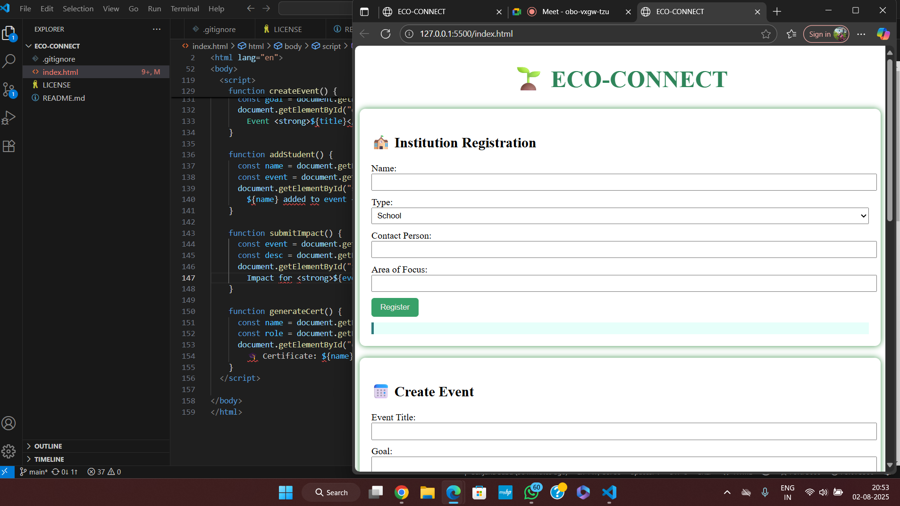

  # 🚀 Green Spark Submission

## Project Title
ECO-CONNECT

## Problem Statement Addressed
"How might we build and deploy technology-driven solutions that actively promote cleaner, greener communities and environmental sustainability?"

## Project Overview
The Institution Collaboration Portal is a lightweight, accessible web application that connects schools, colleges, and NGOs to plan, collaborate, and execute eco-driven events. The platform streamlines event creation, student volunteering, and reporting under one simple portal — all powered by students.

Whether it’s a tree-planting drive, a waste management awareness campaign, or an energy-saving initiative, this portal helps institutions log their efforts and receive recognition.

## Key Features
-  Institution Registration: Simple form to onboard schools, colleges, and NGOs with focus area
- Event Creation: Organize and define goals for sustainability events
- Student Volunteer Management: Assign volunteers to specific events
- Impact Reporting: Collect descriptions and outcomes of environmental drives
- Certificate Generation: Auto-generate participation certificates for volunteers

## GitHub Repository Link
https://github.com/Sanjanasabu27/Eco-connect

## Team Members & Roles
- Nithya sanalkumar - Project co-ordinater
- sanjana S – Frontend
- Sana S - Backend
- Nadhiya A-Documentation and text

## Screenshot
